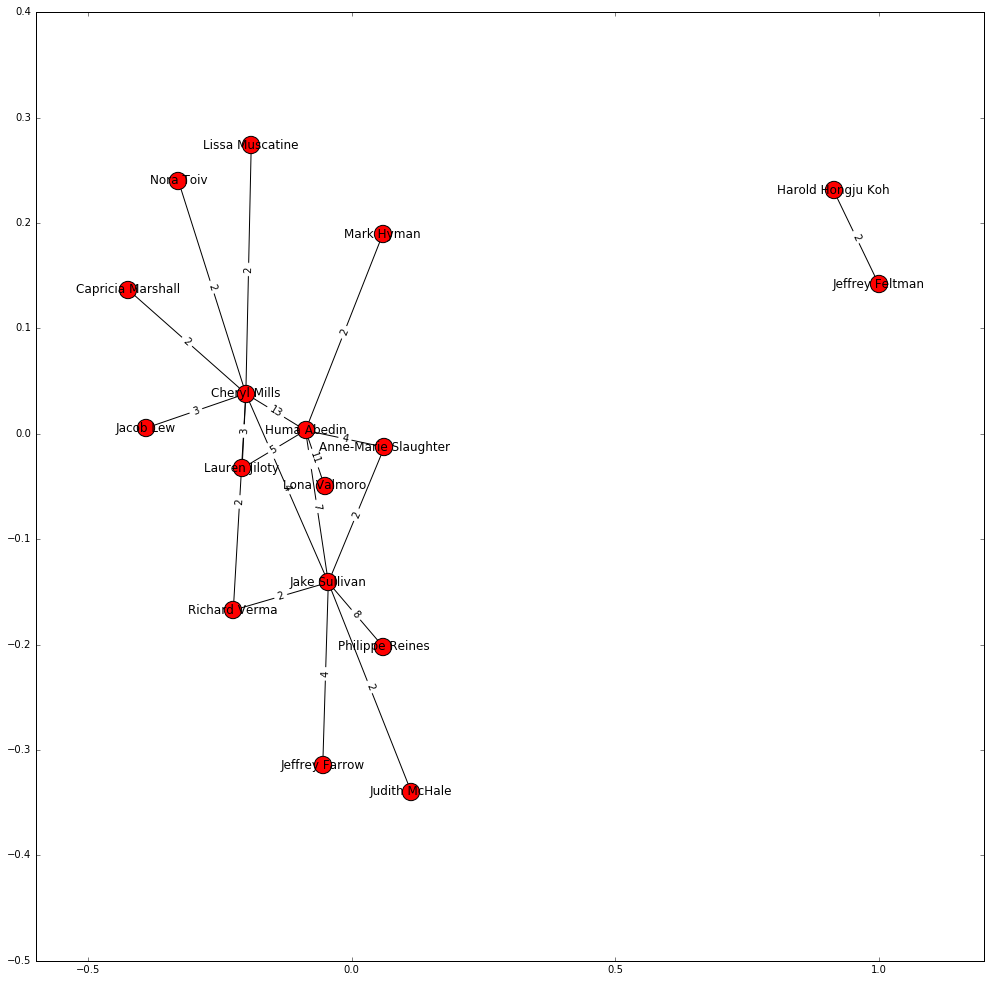

### Network Analysis of Hillary Clinton Emails

[Kaggle](https://www.kaggle.com), as part of a [competition](https://www.kaggle.com/c/hillary-clinton-emails), made available over 7,000 pages of emails sent by Hillary Clinton and her associates. I found the emails fascinating not just because of the content, but because they told a story about the inner workings of Clinton's inner circle. I used network analysis and matplotlib to visually demonstrate how Clinton's inner cirlce operated. You can view the code [here](code/hrc_network_analysis_with_graphs.ipynb).


## Hillary's Network

The graph below shows Hillary's network based on email senders and receivers who sent each other more than 10 emails. Hillary, of course, is at the center of the network. However, there are also interesting patterns where secondary nodes (e.g., Huma Abedin and Lona Volmaro) are interacting with each other).


It isn't surprising that Hillary is at the center of the network. Of the 7,000+ emails analyzed, Hillary is either a sender or a receiver in the top 15 sender-receiver pairs.


Another interesting aspect of the Hillary email story is how does information flow when Hillary Clinton is not a sender or receiver of the emails. In this case, we find that there is no one true central node. Instead, Huma Abedin, Cheryl Mills, and Jake Sullivan are now the main arbiters of information.



## To Run

Run in Jupyter using the below:

```
- Import Pandas
- Import sqllite
- Import networkx
- Import matplotlib.pyplot
```